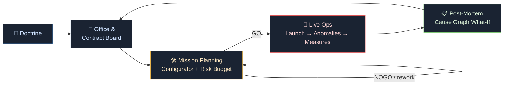

# 🚀 GO/NOGO

```
   ▄████  ██▀███  ▓█████  ▄████▄   ██░ ██  ▒█████    ██████ ▄▄▄█████▓
  ██▒ ▀█▒▓██ ▒ ██▒▓█   ▀ ▒██▀ ▀█  ▓██░ ██▒▒██▒  ██▒▒██    ▒ ▓  ██▒ ▓▒
 ▒██░▄▄▄░▓██ ░▄█ ▒▒███   ▒▓█    ▄ ▒██▀▀██░▒██░  ██▒░ ▓██▄   ▒ ▓██░ ▒░
 ░▓█  ██▓▒██▀▀█▄  ▒▓█  ▄ ▒▓▓▄ ▄██▒░▓█ ░██ ▒██   ██░  ▒   ██▒░ ▓██▓ ░
 ░▒▓███▀▒░██▓ ▒██▒░▒████▒▒ ▓███▀ ░░▓▓▓ ░██░ ████▓▒░▒██████▒▒  ▒██▒ ░
```

[](https://github.com/Pappet/go-nogo/actions/workflows/ci.yml)
[](https://www.typescriptlang.org/)
[](https://svelte.dev/)
[](https://vitejs.dev/)
[](https://vitest.dev/)
[](https://nodejs.org/)
[](https://github.com/Pappet/go-nogo/pulls)

> **Mission-control spaceflight management where you are the flight director and the startup CEO — in one chair.**

> *Replay value comes from decision space, not from dice.*

## ❓ What is GO/NOGO?

**GO/NOGO** is a *reverse Kerbal*: you never touch the stick — you build the rocket, brief the crew, watch the telemetry, and make the calls. Launch, orbit, anomaly: every crisis arrives on your consoles, and every measure you order competes with every other for power, crew attention and seconds of mission time. When something breaks, you don't reload — you diagnose through a **cause graph**, weigh the priors, act under scarcity, and read the honest truth in the **post-mortem** afterwards.

And it's a company. Parts arrive with serial numbers, QA levels and redundancy — *the same serial number is the same part in every what-if*. Markets rate you, doctrines shape you, the risk budget tightens with every watt you trade away. When the loss-of-mission number moves, you'll know exactly which decision moved it.

Everything is **bit-for-bit deterministic**: fixed 50 ms ticks, seeded and hashed RNG, SHA-256 state hashes, replay fixtures in CI. A mission is a decision log you can replay, fork and audit — the same seed always tells the same story.

| | |
|---|---|
| 🎮 **Genre** | Mission-control spaceflight management / strategy sim |
| 🌐 **Platform** | Browser (Web), TypeScript + Canvas 2D / SVG |
| 🧑‍🚀 **Role** | Flight director & startup CEO in one person |
| ⏱️ **Session length** | One mission in minutes, a campaign over an evening |
| ♻️ **Replay value** | Decision space, not dice — deterministic seeds, forks, post-mortems |

## 🎮 Gameplay

> *Replay value comes from decision space, not from dice.* — the design motto everything below serves.

### The Core Loop

You are two people at once: flight director in the control room, CEO upstairs. Every week you make one strategic move; every mission you fight for it live. The loop is:



**Planning is where the game is decided.** The configurator builds the vehicle from parts — each with a serial number, a QA level and optional redundancy — and every change moves the **live risk budget**: adding a backup unit or upgrading QA pulls the loss-of-mission probability down, and the mass you pay for it shows up immediately in the Δv column. Retry is surgical, too: reopen the planner, swap one part, and only *that part* re-rolls — the rest of the mission stays bit-identical, because every part's reliability is drawn as `hash64(seed, serialNo, context)`. The same part is the same part in every what-if.

### The Five Consoles

| Console | Phase | What it does |
|---|---|---|
| 🚀 **LAUNCH** | 0 | The countdown and flight console: checklist, telemetry, orbit map (Canvas 2D), gauges (SVG). Auto-pause is a sim state, not a UI timer. |
| 🔧 **ENGINEERING** | 1 | Diagnosis under resource scarcity: read the anomaly, weigh the cause graph with its priors, queue measures against time, power and crew attention. |
| 📋 **POST-MORTEM** | 1 | The learning console: replay the failure, walk the cause graph, run what-ifs — *what if I had swapped that serial number?* — and see the counterfactual hash-identical down to the part. |
| 🛠️ **CONFIGURATOR** | 2 | The vehicle workshop: parts with QA levels and redundancy, live risk budget, Δv and mass trade-offs, the surgical retry path. |
| 📡 **COMMS** | 2 | The market interface: accept contracts from three markets, manage reputation, spend research data on the tech tree. |

### 🧭 Three Doctrines

Doctrine is your company's operating philosophy, and it is not a cosmetic banner. Each of the three doctrines reshapes what the risk budget tolerates, which parts make sense to buy, and how the same crisis should be answered. A conservative doctrine and an aggressive one diverge mechanically within three hours of play — same physics, same anomalies, different correct decisions.

### 🏪 Three Markets, One Reputation

Contracts come weekly from the board, offered by three markets with different appetites and different memories. Fail a mission and reputation moves; reputation gates both what is offered and the **minimum guarantee** — the floor of income you can still count on when things go badly. Reputation is the economy's memory: it makes the difference between a rough patch and a slow-motion **bankruptcy** (a soft fail — the campaign ends with a post-mortem, not a crash dialog).

### 🌳 The Tech Tree — and Its First Fork

Research data earned in flight (COMMS) feeds a tech tree across propulsion and avionics, levels 1–3. Early on, upgrades are simply better. At the fork, they are not: you choose a branch and the other one closes. Doctrine, market and fork together are what make a second campaign a *different game* — plus **two starting scenarios** and a **sandbox** that unlocks after your first orbit.

## 🛠️ Development

### Prerequisites

| Requirement | Version | Why |
|---|---|---|
| **Node.js** | `>= 22` | Modern ESM + toolchain baseline |
| npm | bundled with Node | `npm ci` for reproducible installs |

No native dependencies, no audio assets, no server — everything runs in the browser.

### Quickstart

```bash
git clone https://github.com/Pappet/go-nogo.git
cd go-nogo
npm ci          # reproducible install from the lockfile
npm run dev     # Vite dev server → http://localhost:5173
npm test        # full test suite
```

### Scripts

| Script | What it does |
|---|---|
| `npm run dev` | 🔥 Vite dev server with HMR |
| `npm run build` | Production build (type-checked by Vite pipeline) |
| `npm run preview` | Serve the production build locally |
| `npm run typecheck` | `tsc --noEmit` — strict, zero `any` |
| `npm run check` | `svelte-check` — because `tsc` does not read Svelte templates |
| `npm test` | Vitest suite, single run (CI mode) |
| `npm run test:watch` | Vitest in watch mode |
| `npm run lint:graph` | 🕸️ Cause-graph linter — validates diagnosis graph integrity |

> 💡 **CI runs `typecheck`, `check`, `test`, `build` and `lint:graph` on every push.** Run them locally in the same breath — `tsc` and `vite build` both happily compile a console calling a method that no longer exists; only `svelte-check` catches it.

### Architecture

```
src/
├── sim/          # ⏱️ Deterministic core — engine, math, rng, countdown, flight
│   ├── physics/      # Kepler, thrust, ascent programs, constants
│   ├── diagnosis/    # Cause graph, priors, measures, post-mortem
│   ├── systems/      # Anomaly runtime
│   └── parts/        # Serial-numbered parts, QA, redundancy
├── economy/      # 💼 Between-missions layer (no ticks here)
│                    # riskBudget · markets · reputation · staff · techTree · campaign · doctrine · scenario · bankruptcy
├── data/         # 📋 JSON tuning data — every number lives here, never hard-coded
├── replay/       # 🎞️ Deterministic replay, SHA-256 state hashing, seed-42 fixtures
├── save/         # 💾 Campaign persistence + bit-exact mid-mission resume
├── ui/           # 🖥️ Svelte 5 consoles: launch, engineering, configurator, comms, postmortem
│                    # Canvas 2D orbit map · SVG gauges · Web Audio synth · strings.ts
└── main.ts
tools/            # 🕸️ graphLint.ts — cause-graph linter (also runs in CI)
```

The boundary is strict: `src/sim/` imports nothing from `src/ui/`. The UI talks to the sim only through tick-stamped commands in the queue.

### 🔒 Determinism

The rules inside `src/sim/**` are non-negotiable — they are what makes replays, save/resume and surgical re-rolls possible:

- 🚫 **No wall clock, ever.** No `Math.random`, `Date`, `performance.now()`, `setTimeout`/`setInterval` inside the sim.
- 📐 **No unpinned transcendental math.** No `Math.sin/cos/tan/atan2/exp/log/pow` — these are not bit-identical across engines. All of it comes from `sim/math.ts` with pinned test vectors. (`Math.sqrt`, `abs`, `min`, `max`, `imul` & co. are fine.)
- ⏱️ **Fixed 50 ms ticks.** Time warp means *more ticks per frame* or analytical Kepler evaluation — never a scaled `dt`.
- 📨 **All inputs are tick-stamped commands** through the queue. The UI never mutates sim state directly.
- 🎲 **Two RNG tracks:** `hash64(seed, serialNo, context)` for everything tied to configuration (the same part is the same part in every what-if), separate `mulberry32` streams per system for event sequences. Hash test vectors are pinned — changing the hash is a breaking change.
- #️⃣ **State hashing via canonical binary encoding** (`DataView.setFloat64`, little-endian, fixed schema order) → SHA-256. Never `JSON.stringify`. `NaN`/`Infinity` are debug-asserted away.

## 🧪 Testing & CI

The sim is deterministic, so the tests are deterministic too. The whole test strategy rests on one idea: **if the bytes of the final state hash match, nothing that matters changed.**

| Test | What it pins down |
| --- | --- |
| 🔁 **Replay fixture** | Seed 42 + a fixed command log → SHA-256 of the final state must equal the checked-in reference. Any change to physics or the engine moves the hash — moving it is allowed, but only deliberately, with a justified fixture regeneration in the commit. |
| 💾 **Save/resume** | Save at T+90 s, resume, keep flying → final state hash identical to the same run saved nowhere. A mid-mission save is not "mostly correct", it is bit-exact or it fails. |
| ⏩ **Double playback** | Play the same replay twice → identical hash series, sampled every 600 ticks. Determinism is proven per-interval, not just at the end. |
| 📐 **Pinned math & RNG vectors** | `sim/math.ts` (own transcendental implementations) and `sim/rng.ts` (`hash64`, `mulberry32`) each carry pinned test vectors. Every change to them is a breaking change, by test. |
| 🕸️ **Cause-graph linter** | `tools/graphLint.ts` validates the diagnosis graph on every push — a broken anomaly graph can never merge silently. |

CI runs **typecheck, `svelte-check`, Vitest, build and the cause-graph linter** on every push. Because `tsc --noEmit` and `vite build` both read zero Svelte templates, `svelte-check` is not optional polish — it is the only gate that catches a console calling a method that no longer exists. A green pipeline is the badge-worthy gate: 🟢 all of it, every push.

## 🗺️ Roadmap

| Phase | Status | Contents |
| --- | --- | --- |
| **0 · The Countdown** | ✅ **Done** | Deterministic sim engine, Kepler physics, launch console, replay fixtures + SHA-256 state hashing |
| **1 · Diagnosis** | ✅ **Done** | Anomaly runtime, diagnosis with cause graph + priors, measures under resource scarcity, post-mortem |
| **2 · The Game Emerges** | 🔨 **In progress** | Parts with serial numbers / QA / redundancy · live risk budget · configurator console · 3 doctrines · 3 markets with reputation · tech tree with exclusive forks · COMMS console · staff · bankruptcy soft fail · mid-mission save · 2 scenarios + sandbox unlock · tutorial missions · i18n string externalisation · hotkey rebinding |
| **3a** | ⬜ *Not started* | Fleet ops, light delay |
| **3b** | ⬜ *Not started* | Policies, leaderboard & challenges (backend) |
| **4** | ⬜ *Not started* | Ghost replays, post-mortem export, achievements, modding, Steam / Tauri |

Later phases are listed for orientation only — nothing beyond Phase 2 is designed, scaffolded or promised.

## 🔗 Links

- 📄 **[docs/CONCEPT_v4.md](docs/CONCEPT_v4.md)** — the full design freeze
- 🤖 **[CLAUDE.md](CLAUDE.md)** — project rules for AI contributors
